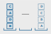
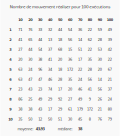
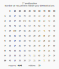
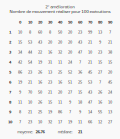

# Empilateur-TP1-SMA

Baptiste Magous -Thibaut Delplanque 

## Présentation du code

## Analyse des résultats

A l'aide de notre implémentation, nous pouvons exécuter nos agents, dit agents tropiques, pour notre problème d'empilement ordonné de bloc. 

Dans cette première implémentation, nos agents se contente de se déplacer seulement si ils n'ont pas atteint le objectif ou si un bloque en dessous de eux, les poussent. Enfin, nos agents vérifie seulement si le bloque en dessous de eux corresponds à leur objectif.

Reprenons l'exemple du cours, où nous avons 4 agents (bloques) identifier avec les lettres A, B, C ou D pour seulement 3 pile. la configuration de départ se présente de la manière suivante, nos quatre agents sont empiler sur une seule pile, dans l'ordre B, D, A et C (de bas en haut) et doivent atteindre la configuration, A, B, C et D.

Dans la plus grande majorité des cas, nous arrivons à atteindre la situation voulus, par exemple, pour une exécution nous arrivons à l'objectif finale avec **41** mouvements.

Nous pouvons analyse la performance de nos agents pour cette première implémentation, on exécute 100 fois le scénario et on regarde les résultats qu'on obtient.

On remarque que sur nos **100** exécutions, on atteint la solution **97%** du temps, la moyenne des mouvements pour l'atteindre est de **43,93** et la médiane est de **38** mouvements. Nous pouvons aussi voir que lors d'une exécution, on à obtenus la solution en **8** mouvement, alors que le nombre de mouvements théorique est de **7**.

## Amélioration et stratégies

Nous pouvons, maintenant, améliorer le comportement de nos agents et proposer des stratégies de coordination pour rendre plus performant la planification.

### Stratégie 1

Cette première stratégie consiste à améliorer la fonction d'évaluation de l'objectif de nos agents, au lieux de vérifier  si l'agent est sur le bloque voulus, l'agent va vérifier en plus, si tous les agents en dessous de lui on atteint leur objectifs pour considérer son objectif satisfait.

Avec cette première stratégie, sur **100** lancer, on atteints la solution **99%** du temps, le moyenne des mouvements est de **40,48** et la médiane est de **33** mouvements. 

Cette première amélioration semble nous donner de meilleurs résultats que l'implémentation initiale.

### Stratégie 2

Notre seconde stratégie est 

