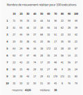
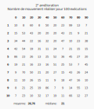

# Empilateur-TP1-SMA

Baptiste Magous -Thibaut Delplanque 

## Exécution du code

La structure du projet se présente de la manière suivante :

```basic
Empilateur-TP1-SMA/
├─ doc/
│  └─ reports/
├─ img/
└─ src/
   └─ main/
     └─ java/
        └─ com.example.empilateurtp1sma/
           ├─ agents/
           ├─ environment/
           ├─ Main.java
           ├─ Main2.java
           ├─ Main3.java
           └─ MassiveExecution.java
```

La classe `Main` permet d'exécuter le scénario du cours, sans amélioration des agents.

Les classes `Main2` et `Main3` permettent, respectivement, d'exécuter le scénario du cours avec la première amélioration et la seconde amélioration.

Enfin, la classe `MassiveExecution` permet d’exécuter n'importe lequel des trois scénarios précédents, plusieurs fois. Dans cette classe, vous pouvez préciser le nombre de scénarios à lancer et quel scénario vous voulez lancer. Pour le type de scénario vous pouvez choisir entre les trois valeurs suivantes:

- **1** : scénario de base
- **2** : amélioration numéro 1
- **3** : amélioration numéro 2

```java
    [...] 
    public static final int nbScenario = 100;
    public static final int scenario = 1;
	[...] 
```

Après chaque exécution de scénario, vous pouvez retrouver l'intégralité des rapports des scénarios dans le dossier `doc/reports/`. Chaque rapport, écrit en Markdown, contient les informations de l'exécution d'un scénario, le nombre de mouvements réalisés, tous les états du scénario ainsi que la liste des actions réalisés par les agents, ordonné par type.

Après plusieurs exécutions, vous pouvez **supprimer le dossier reports** pour nettoyer le projet de tous les rapports. Le dossier sera recréé automatiquement après la première exécution. 

## Présentation du code

Pour le problème d'empilement de blocs ordonnés, nous somme partis sur l'implémentation suivante :


## Analyse des résultats

À l'aide de notre implémentation, nous pouvons exécuter nos agents, dit agents tropiques, pour notre problème d'empilement ordonné de blocs. 

Dans cette première implémentation, nos agents se contentent de se déplacer, seulement s'ils n'ont pas atteint leur objectif ou si un bloc en dessous de eux les poussent. Enfin, nos agents vérifient que le bloc en dessous d'eux corresponde à leur objectif.

Reprenons l'exemple du cours, où nous avons 4 agents (blocs) identifiés avec les lettres A, B, C ou D pour 3 piles. La configuration de départ se présente de la manière suivante : nos quatre agents sont empilés sur une seule pile, dans l'ordre B, D, A et C (de bas en haut) et doivent atteindre la configuration, A, B, C et D.


Dans la plus grande majorité des cas, nous arrivons à atteindre la situation voulue. Par exemple, sur une exécution nous arrivons à l'objectif final avec **41** mouvements.

Pour analyser la performance de nos agents avec cette première implémentation, nous exécutons 100 fois le scénario. Nous obtenons les résultats suivants :



On remarque que sur nos **100** exécutions, on atteint la solution **97%** du temps. La moyenne des mouvements pour l'atteindre est de **43,93** et la médiane est de **38** mouvements. Nous pouvons aussi voir sur nos exécutions, la meilleure solution est en **8** mouvements, alors qu'il existe une solution en **7** mouvements.

## Amélioration et stratégies

Nous pouvons maintenant améliorer le comportement de nos agents et proposer des stratégies de coordination pour les rendre plus performants.

### Stratégie 1

Cette première stratégie consiste à améliorer la fonction d'évaluation de l'objectif de nos agents. Au lieu de vérifier si l'agent est sur le bloc voulus, l'agent va vérifier en plus, si tous les agents en dessous de lui ont atteint leur objectif pour considérer son objectif satisfait.

Cette stratégie va nous permettre de voir si le simple fait d'améliorer la fonction d'évaluation de nos agents va améliorer l'organisation globale ou si nous devons rajouter d'autre comportements en plus.


Avec cette première stratégie, sur **100** lancers, on atteint la solution **99%** du temps, le moyenne des mouvements est de **40,48** et la médiane est de **33** mouvements. 

Cette première amélioration semble nous donner de meilleurs résultats que l'implémentation initiale.

### Stratégie 2

Notre seconde stratégie consiste à ne faire réaliser à nos agents que des déplacements utiles. C'est-à-dire que nos agents effectueront leurs déplacements seulement si celui-ci valide leur objectif. 

On ajoute à cette stratégie quelques règles supplémentaires pour éviter les situations auto-bloquantes:

- Les agents doivent bouger s'ils sont poussés par un agent en dessous d'eux.
- Les agents qui n'ont pas pour objectif le bas de la pile et qui se retrouvent à même le sol, doivent bouger. Cette règle évite d'entrer dans une situation bloquante où tous les agents se retrouvent à la base d'une pile et n'ont plus envie de bouger sauf un agent qui est le seul à vouloir être à la base de la pile et qui ne peut pas).
- Les agents satisfaits, poussent les agents insatisfaits au-dessus d'eux (cette règle évite, lorsque la pile commence à se former correctement, de voir des agents se mettre à son sommet, insatisfaits et la bloquer.



Avec cette seconde stratégie, sur **100** lancers, on atteint la solution **100%** du temps, le moyenne des mouvements est de **26,76** et la médiane est de **21** mouvements. 
